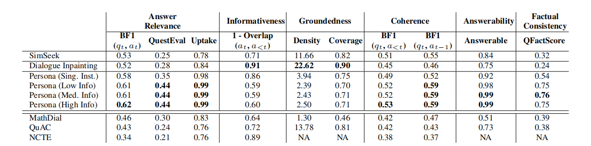

# 📖 Book2dial: Generating Teacher Student Interactions from Textbooks for Cost-Effective Development of Educational Chatbots

[ACL 2024 Findings paper](https://aclanthology.org/2024.findings-acl.578/)

[ACL 2024 Video](https://www.youtube.com/watch?v=l1QCl7ENnWU)


[![CC BY-SA 4.0][cc-by-sa-shield]][cc-by-sa]

📖 Book2dial is grounded in textbooks from four domains: math, business, science, and social science. Our dataset contains teacher-student interactions that take the form of conversational question-answering (QA) interactions, where curious students ask teachers questions about the textbook content, and teachers provide answers based on the textbook.

# Description
In this project, we propose a framework for generating synthetic teacher-student interactions grounded in textbooks. Our approaches capture one aspect of learning interactions where curious students with partial knowledge interactively ask a teacher questions about the material in the textbook. We highlight various quality criteria such dialogues should fulfill and compare several approaches relying on either prompting or fine-tuning large language models. We provide evidence in our paper to show our generated dialogue dataset can be used to fine-tune educational chatbots.

# Citation
Please cite the following:
> Junling Wang, Jakub Macina, Nico Daheim, Sankalan Pal Chowdhury, and Mrinmaya Sachan. 2024. Book2Dial: Generating Teacher Student Interactions from Textbooks for Cost-Effective Development of Educational Chatbots. In Findings of the Association for Computational Linguistics ACL 2024, pages 9707–9731, Bangkok, Thailand and virtual meeting. Association for Computational Linguistics.

# Dataset
The dataset is available in the data folder. It contains 889 conversations generated from the Persona(High Info) model. We will release more data later. 
Please note that each row in the file consists of full conversations between a teacher and a student in JSON format.



## Data Structure
- `title` - the title of the current textbook chapter
- `history` - content of this conversation
- `qas` - list of question and answer pairs
- `uid` - unique identifier of the conversation

## Generating Your Own Dialogue Datasets from Textbooks!!
### Step 1: Transfer your textbook into a json file with following format:
```json
{
    "data": [
        {
            "title": "1-1-physics-definitions-and-applications",
            "paragraphs": [
                {
                    "context": "Think about all of the technological devices that you use on a regular basis. Computers, wireless internet, smart phones, tablets, global positioning system (GPS), MP3 players, and satellite radio might come to mind.",
                    "id": "C_613901_1"
                }
            ],
            "section_title": "What Physics Is",
            "chapter_learning_objectives": [
                "Describe the definition, aims, and branches of physics",
                "Describe and distinguish classical physics from modern physics and describe the importance of relativity, quantum mechanics, and relativistic quantum mechanics in modern physics",
                "Describe how aspects of physics are used in other sciences (e.g., biology, chemistry, geology, etc.) as well as in everyday technology"
            ],
            "chapter_summary": "Physics is ...",
            "chapter_introduction": "",
            "bold_terms": [
                "physics",
                "atoms",
                "quantum mechanics",
                "classical physics",
                "modern physics",
                "theory of relativity"
            ],
            "chapter_concept": [
                {
                    "name": "accuracy ",
                    "description": "how close a measurement is to the correct value for that measurement"
                },
                {
                    "name": "ampere",
                    "description": " the SI unit for electrical current"
                }
            ]
        }   
    ]
}
```
### Step 2: Install dependency
```bash
cd book2dial
pip3 install ./requirements.txt
```

### Step 3: Dialogue generation
Change the input path within ./Persona_models/Persona_high_info_final.py file:

```python
# Load the data
    with open("<your textbook json file path>", "r") as file:
        data = json.load(file)
```

### Step 4: Set your open ai key into environment through:
```bash
touch ./Persona_models/.env.local 
export OPENAI_API_KEY=<your openai key>
```

### Step 5: Run the following command in terminal:

```bash
python3 ./Persona_models/Persona_high_info_final.py
```

This work is licensed under a
[Creative Commons Attribution-ShareAlike 4.0 International License][cc-by-sa].

[cc-by-sa]: http://creativecommons.org/licenses/by-sa/4.0/
[cc-by-sa-shield]: https://img.shields.io/badge/License-CC%20BY--SA%204.0-lightgrey.svg